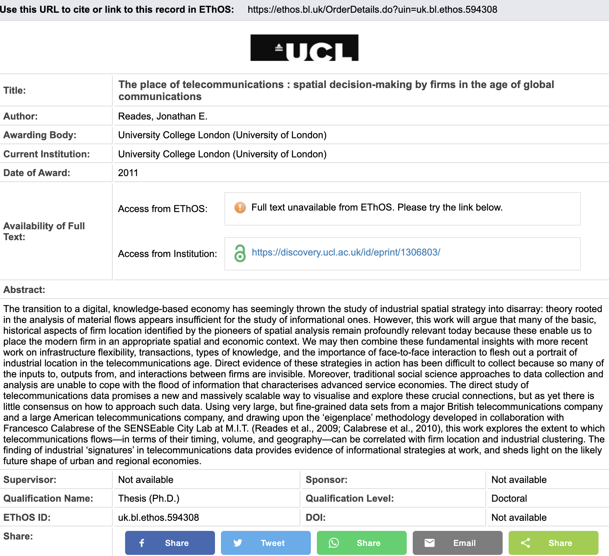
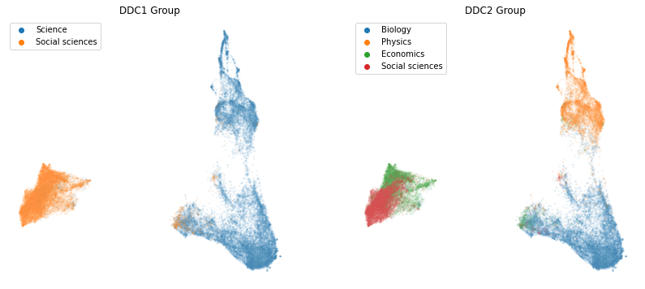
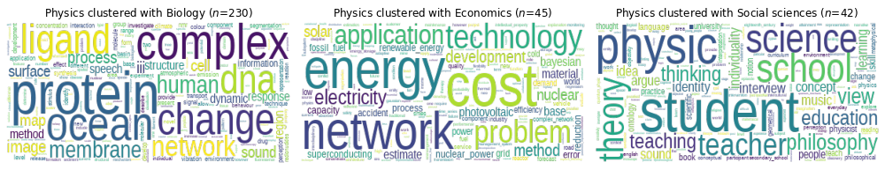
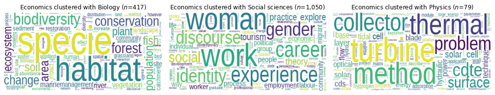
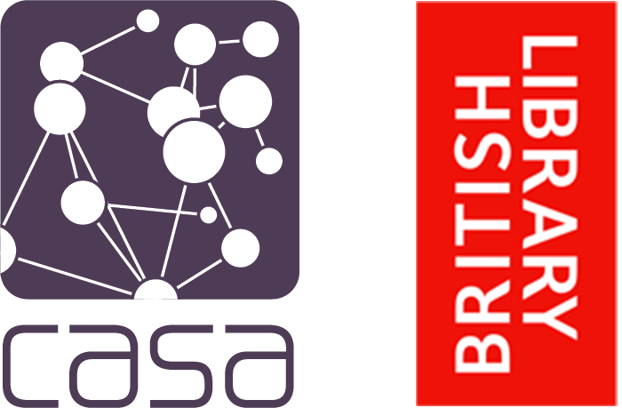

---
format:
  revealjs:
    theme: [serif, ../css/slides.scss]
  html:
    embed-resources: true
author: "Jon Reades & Jennie Williams"
footer: "Jon Reades & Jennie Williams (CASA @ UCL)"
highlight-style: github
code-copy: true
code-line-numbers: true
slide-level: 2
title-slide-attributes:
  data-background-image: ../img/CASA_Logo_no_text.png
  data-background-size: cover
  data-background-position: center
  data-background-opacity: "0.17"
logo: ./img/Joint_Logo.png
fig-cap-location: top
history: false
css: ../css/slides.css
---

# Comparing automated document classification using word embeddings to expert-assigned Dewey Decimal classifications {background-image="./img/books.png" background-opacity=".18"}

::: {.notes}
We hope to achieve two things with this tutorial:

1. To briefly explain how Natural Language Processing (NLP) opens up new ways of engaging with archives.
2. To test whether NLP can measure up to the expertise of a human on document classification.

To be clear, we see this as augmenting existing practices: I hope no one comes away from this thinking that we're suggesting that NLP can somehow replace librarians.
:::

---

## Two Objectives {visibility="hidden"}

We hope to achieve two things with this tutorial:

1. To briefly explain how Natural Language Processing (NLP) opens up new ways of engaging with archives.
2. To test whether NLP can measure up to the expertise of a human on document classification.

::: {.notes}
To be clear, we see this as augmenting existing practices: I hope no one comes away from this thinking that we're suggesting that NLP can somehow replace librarians.

So in the remainder of this talk we hope to (briefly) look at how we handle text 'at scale' and then apply this technique to a real-world archive to make a small contribution to existing practices. 
:::

## About EThOS

{height="550" fig-alt="Content loaded from EThOS URL: https://ethos.bl.uk/OrderDetails.do?uin=uk.bl.ethos.594308"}

::: {.notes}
Our tutorial makes use of the British Library's EThOS data set. Ethos is, technically, metadata because stores data *about* theses: the title, author, date of submission, etc. The vast majority of **UK** doctoral theses have a metadata record in EThOS:

- Earliest is in Latin (pre-dates the modern PhD by 100 years)!
- Over 520,000 records (and growing continuously)
- Data quality varies widely (and evolving continuously)

Ethos has obviously not existed since 1812, so from this you might infer that some universities have been more meticulous than others in entering 'old data' into the BL's data store. As you might expect, data quality varies wildly: the further back you go, the worse the data quality, so we've focussed on more 'recent' records, dating back to the 1980s.
:::

## Completeness 

| Field | Overall | 1970s | 1980s | 1990s | 2000s | 2010s |
| :---- | ----: | ----: | ----: | ----: | ----: | ----: |
| Abs. | 50 | 19 | 21 | 29 | 42 | 88 | 
| Key. | 50 | 12 | 89 | 84 | 32 | 47 |
| DDCs | 91 | 93 | 98 | 98 | 97 | 83 |
| Dept.| 29 | 17 | 16 | 13 | 21 | 53 |
| Count| 526,276 | 40,318 | 59,825 | 88,598 | 136,172 | 176,171 |

: Percentage Complete by Decade

::: {.notes}
Ethos has already been used via manual keyword and topic selection to select theses offering insight into novel chemical compounds [@Andrews:2016], post-colonial relations [@Montgomery:2019], and career progression in dementia research [@Howe:2015].

But if we want to categorise dissertations, then things get trickier: there is clear evidence of changing practices in the completeness measures, but the DDC, which as a reminder stands for Dewey Decimal Classification, is fairly consistent throughout. 
:::

## DDC as 'Expert Label'

+-------------------------------+---------------------------+------------+
| DDC1 Group ('Class')          | DDC2 Group ('Division')   | Count      |
+===============================+===========================+===========:+
| **Science (500–599)**         |                      | **27,095** |
|                               | Biology (570–579)    |     18,418 |
|                               | Physics (530–539)         |      8,677 |
+-------------------------------+---------------------------+------------+
| **Social Sciences (300–399)** |                      | **21,648** |
|                               | Economics (330–339)  |     12,625 |
|                               | Social Sciences (300–309) |      9,023 |
+-------------------------------+---------------------------+------------+
| **Total**                     |                           | **48,743** |
+-------------------------------+---------------------------+------------+

::: {.notes}
So to test our approach, we used the DDC to choose four disciplines that we thought would present a range of challenges for an automated approach.

We treated the DDC as the expert label, which is a 'term of art' from Machine Learning where it's part of the training process: Google's image search and street view platforms didn't spontaneously 'learn' how to recognise different types of birds or crosswalks, they were trained by an army of 'experts' of varying abilities. If you've filled in one of the image-based Captchas, to verify that you're a human being, then you've been dragooned into that army.

So if we want to know whether our NLP approach has any merit at all, then we need that 'expert-assigned label' and that's where the DDC comes in: although there are plenty of problems with DDCs, it does give us a sense of where a librarian thinks a piece of work belongs.

That sample sample of **48,743** records is what we fed into our NLP pipeline.
:::

# From Text to Data

::: {.notes}
So what's a NLP pipeline? 

It's three stages of data processing: cleaning, clearning, and analysis.

1. In the cleaning stage, we are looking to standardise the texts that we're going to process. 
2. In the learning stage, the computer learns--in a statistical sense--about the cleaned corpus.
3. AIn the analysis phase, we take what the computer has learned and convert that back into forms of knowledge that we humans can comprehend.

I'm going to briefly talk through each of these on the following slides, and *then* go back an illustrate the key outputs from each stage.
:::

## {auto-animate=true auto-animate-easing="ease-in-out" auto-animate-duration=.6}

### Cleaning

- Removal of Punctuation / Symbols / HTML
- Named Entity Recognition (including acronyms)
- Lemmatisation
- Removal of Stop Words
- Phrase Detection
- Reduction of Vocabulary

### Learning

### Analysis

::: {.notes}

The purpose of the cleaning stage is to radically reduce the overall vocabulary by standardise word forms, finding meaningful turns of phrase, and stripping out high- and low-frequency words.

:::

## {auto-animate=true auto-animate-easing="ease-in-out" auto-animate-duration=.6}

### Cleaning

### Learning

- Learning of Context
- Weighting of Relationships
- 'Training' of Word Embeddings

### Analysis

::: {.notes}

Context means the words surrounding our 'targets'. So in a historical corpus we might see, for example, "Queen X ruled for 25 years" and "King Y ruled for 4 years". From this we could say that Queen and King are used in similar contexts. Across a large corpus, we might also find that 'she' is used in the context of Queens and 'he' in the context of Kings.

Using Machine Learning we can exploit @Firth:1957, p.11 observation that "You shall know a word by the company it keeps". Working out how to do this using a process called word embedding was the breakthrough that led to the rapid advances in NLP over the past decade.

:::

## {auto-animate=true auto-animate-easing="ease-in-out" auto-animate-duration=.6}

### Cleaning

### Learning

### Analysis

- Dimensionality Reduction
- Hierarchical Clustering
- Validation of Results

::: {.notes}

But even word embeddings are still too much in their raw form for clustering algorithms, so we use a technique called UMAP, which allows us to distill everything down further.

After that, we cluster the documents and, finally, try to measure how well we did.

So let's now loop back and briefly look at what went in and what came out of each phase.

:::

--- 

## Cleaning {.smaller}

|   Source Text   |   Cleaned Text  |
| --------------- | --------------- |
| The economic effects of resource extraction in developing countries. This thesis presents three core chapters examining different aspects of the relationship between natural resources and economic development... | economic effect resource extraction develop_country present_three core examine different_aspect relationship natural_resource economic_developmen... |
| Making sense of environmental governance : a study of e-waste in Malaysia. The nature of e-waste, which is environmentally disastrous but economically precious, calls for close policy attention at all levels of society, and between state and non-state actors… | making_sense environmental_governance study waste malaysia nature waste environmentally disastrous economically precious call close policy attention level society state_non_state actor... |
| An exploratory study of the constructions of 'mental health' in the Afro Caribbean community in the United Kingdom. Afro Caribbean people living in the United Kingdom have historically been overrepresented in the 'mental health' system… | exploratory_study construction mental_health caribbean community united_kingdom caribbean people_live united_kingdom historically mental_health system... |

::: {.notes}
This table compares three randomly-selected documents before and after cleaning to give you a sense of what this process details. You can see that things like captialisation, punctuation and, to a lesser extent, plurals have gone, together with low- and high-frequency words such as 'a' and 'the'. 

You'll also see some underscores, that's where the computer found statistical associations between pairs or triplets of words across multiple documents.
:::

# A vocabulary of 100,000 unique words generates a (sparse) matrix of 10,000,000,000 elements. {visibility="hidden"}

::: {.notes}

The point of cleaning, especially of low- and high-frequency terms, is that *anything* that reduces total vocabulary size benefits computability.

You may recall that I said we started with over 118,000 terms, meaning a matrix of more than 10 *billion* elements. By reducing this to about 30,000 we drop the matrix to 'just' 900 *million* elements, which is a huge gain when you need to hold this matrix in memory. 

Ultimately, however, these are still big tables because they are the square of the total number of terms.
:::

## Learning

| Term | Dim 1 | Dim 2 | Dim 3 | Top 7 Most Similar |
| :---- | --: | --: | --: | :------------------- |
| accelerator | -2.597380 |  0.562458 |  3.047121 | beam, cern, facility, spectrometer, beam_energy |
| london_stock_exchange |  0.516811 | -0.935569 |  1.090004 | ipo, ftse, stock_market, announcement, lse |
| national_health_service |  1.782367 | -2.309419 | -2.430357 | nhs, public_sector, emergency, public_health, developed_world |

::: {.notes}
What the word embedding process does it to convert that text to a vector (that's a row) of 100 numbers--embedding is the technical term--using a 'neural network'. The reduction process tries to ensure that words that are used in similar context end up with similar numeric representations.

Here, again, are some examples. On the left side we have a term from the corpus. The next three columns are the first 3 of the 100 dimensions that we calculated using the word embedding algorithm. So there are 97 more dimensions, but for obvious reasons I'm not showing them here. These numbers don't mean anything to us, but they *do* mean something to the computer.

Finally, on the right side we see terms that are *near*--meaning that they have similar embeddings--to the term on the left side. So accelerator is 'near' to beam, CERN, and other things having to do with high-energy physics, while national health service is, unsurprisingly, near to NHS, public sector, and public health, amongst others.
:::

## How Did We Do? Visualising the Corpus

{.r-stretch fig-alt="Visualisation of corpus after UMAP dimensionality reduction of Word Embeddings"}

::: {.notes}
It's a bit mind-bending, but we can take all the vectors for words in a document and average them together to get a useful representation of the document. So now each *document* is represented by a 100-dimension vector. 

I can't plot or understand that, but I can use UMAP to project those 100 dimensions down into just 2, which is what this visualisation shows. Each dot is a document, coloured according to its original DDC. So the documents are, for the most part, well-separated which is a really promising sign, but there's so much data here it's almost hard to make sense of what's going on.
:::

## How Did We Do? Clustering Accuracy {.smaller}

::: {#tbl-panel layout-ncol=2}

| Cluster  | Science | Social sciences | 
| :------- | ---: | ---: |
| Science  | **26,591** | 479 | 
| Social sciences | 676 | **20,948** | 

: DDC Class (DDC1) 2 Cluster Results {#tbl-first}

| Cluster  | Biology | Economics | Physics | Social sciences | 
| :------- | ---: | ---: | ---: | ---: | 
| Biology | **17,498** | 214 | 514 | 178 | 
| Economics | 417 | **11,063** | 79 | 1,050 | 
| Physics | 230 | 45 | **8,349** | 42 | 
| Social sciences | 165 | 1,880 | 15 | **6,955** | 

: DDC Division (DDC2) 4 Cluster Results {#tbl-second}

Clustering Results
:::

::: {.notes}

These tables are called confusion matrices. If every document was assigned to an NLP-generated cluster that matched with one DDC exactly, then we'd expect to see only the diagonal of this matrix populated. Those are the bold numbers. So any number that isn't bold is a case of our NLP process and the university librarian having a difference of opinion.

So this table tells you that, at the highest level we were about 98% accurate. At the DDC2 level we were about 90% accurate but this masks some variation: in Biology and Physics we had more success in correctly classifying PhDs than we did in Economics and Social science. Roughly a 10% difference in precision and recall.

And where we've struggled are exactly the places you'd expect a human to struggle: distinguishing certain types of biology from physics, when does economics become social science? 

:::

## 'Mis-clustered' Word Clouds

{fig-alt="Word clouds for dissertations assigned to Physics DDC but clustered with another topic."}

{fig-alt="Word clouds for dissertations assigned to Economics DDC but clustered with another topic."}

::: {.notes}
So let's look a little more at the off-diagonals? We've assumed that any difference of opinion between algorithm and expert represents a *mistake* because it's not how the expert classified it. But it's worth asking if a human under any number of practical pressures and constraints is always going to get it right? *I* certainly wouldn't be the person to tell you which subdivision of Physics or Medieval Literature a text was most appropriate for.

So these word clouds use a standard techniques (covered in [other *Programming Historian* tutorials](https://programminghistorian.org/en/lessons/analyzing-documents-with-tfidf)) to pull out potential keywords from the misclassified documents.

And what becomes clear pretty quickly from looking at these is that it's entirely debateable whether the computer is 'wrong'. The 42 physics PhDs clustered with the social sciences look a lot more like the interests of social science in education, philosophy, and training than they do like string theory or particle accelerators. Similarly, the Economics misclassifications are all too easy to interpret logically in terms of valuing the natural environment, issues of identity, and energy generation!

:::

---

## Applications

Dealing with 'born digital' archives:

- Growing problems of scale and context.
- Understanding overall structure of corpus.
- Adding metadata / filling in missing fields.

Improving document retrieval:

- Reduced reliance on 'direct hits'.
- Searching the 'semantic space' means fewer 'near misses'.

Identifying trends:

- Embeddings *may* anticipate discoveries (e.g. @Tshitoyan:2019)

::: {.notes}

So where do we see this kind of approach being useful to 'collections and communities?

The first and most obvious is dealing with 'born digital' archives: in discussions with the BL about text-mining, they've mentioned the issues around the growing provision of personal hard drives as part of a scientist's or author's bequest. I don't know about any of you, but the thought of anyone trying to make much sense of my backup drives is terrifying, and it's worth thinking about just how much 'data' is stored on even the smallest personal backup. 

And if you've ever tried to find something in, say, Outlook then you'll undoubtedly appreciate that Boolean and Regular Expression searches are not going to cut it. Making it worse is that, unlike traditional written correspondence, it will be that much harder to properly contextualise documents from a drive. So the ability to find 'similar' documents in a large corpus will be incredibly important, particularly where word usage has changed over time or where the same word is used to mean different things depending on the context.

Key words are a good place to start, but often if you don't pick the right key word then you get back... nothing at all. Or nothing related to your interests. So this *kind* of approach should mean fewer 'near misses' when we search a large corpus. Quite aside from being able to suggest *other* words that might be related to your search, with Word Embeddings there's now the possibility of detecting 'similar usage, different disciplines or discourses' which could actually help researchers to navigate across disciplinary boundaries, for instance.

Finally, if we put these pieces together then we might gain just a little insight -- however ill-formed -- into the near future. Some recent work in Material Science found that associations found in custom word embeddings (so the next step beyond what we've done here) actually anticipated discoveries by 2 to 3 years! The payoff in the physical sciences of getting even a year ahead of other labs could be enormous, but I'd like to believe that this also opens up more collaborative ways of peering into the future to understand the evolution of a discipline like geography: where are we now? Where does it look like we are going? 

:::

## {background-image="./img/paris.png" background-opacity=.11}

{.absolute height="125" top=0 left=800 fig-alt="Logos of CASA and British Library"}

### Jennie / <a href="https://twitter.com/JenniexWilliams"> \@JenniexWilliams</a> / <a href="https://github.com/jenniewilliams"> jenniewilliams</a>

### Jon / <a href="https://twitter.com/jreades"> \@jreades</a> / <a href="https://github.com/jreades"> jreades</a>

### Acknowledgements

We'd like to thank the British Library (particularly the EThOS team) and [Programming Historian](https://programminghistorian.org)/[Jisc](https://www.jisc.ac.uk) for their support, guidance, and encouragement. We gratefully acknowledge the contribution of the ESRC via the [LISS](https://liss-dtp.ac.uk) and [UBEL](https://ubel-dtp.ac.uk/) DTPs to making Jennie's research possible.

### References

::: {.notes}
So the E-Theses Online (or EThOS) data store that we're using is one example of the kind of work that the BL is enabling; but there is also, for instance, the Internet Archive of UK web domains as another really exciting source for those of who are computationally inclined. And, with luck, you're starting to think about how such an approach might be useful to *you*...

I hope that this has given you a sense of why we are so excited about this tutorial: first, everything we used (the data, the code, *everything*) is open; second, we provided the computer with few clues about the corpus, but from a fragmented record of titles and abstracts we were able to organise a large corpus into groups that are nonetheless intelligible to human beings. 

We've already identified some ways that we think the results could be improved, but these will take time to implement and we're just beginning what is likely to be a journey that last well beyond the completion of Jennie's PhD.

So that's it from us!
:::
