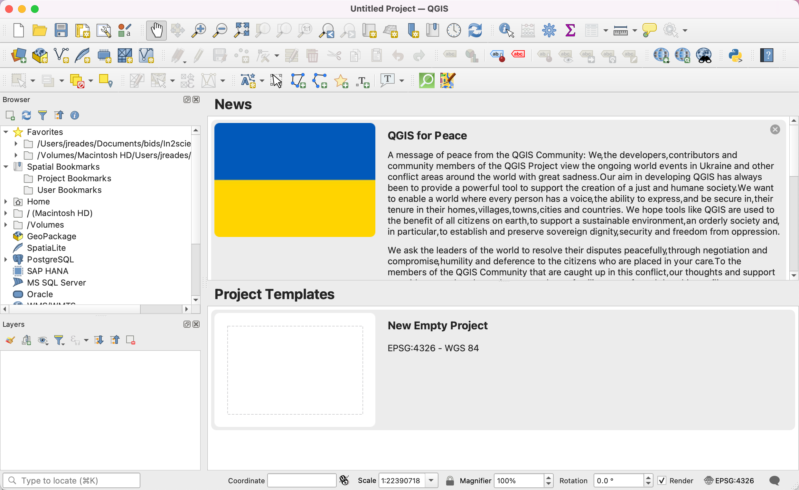
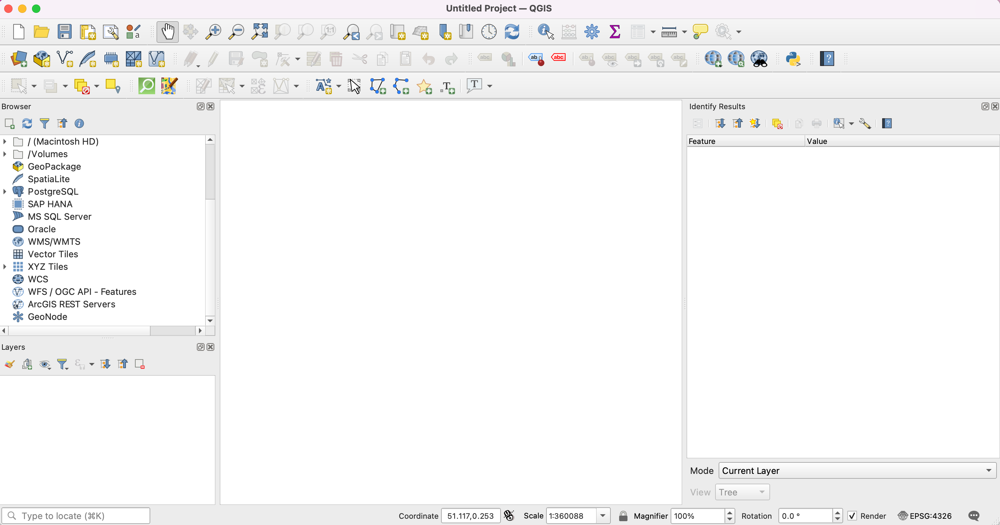
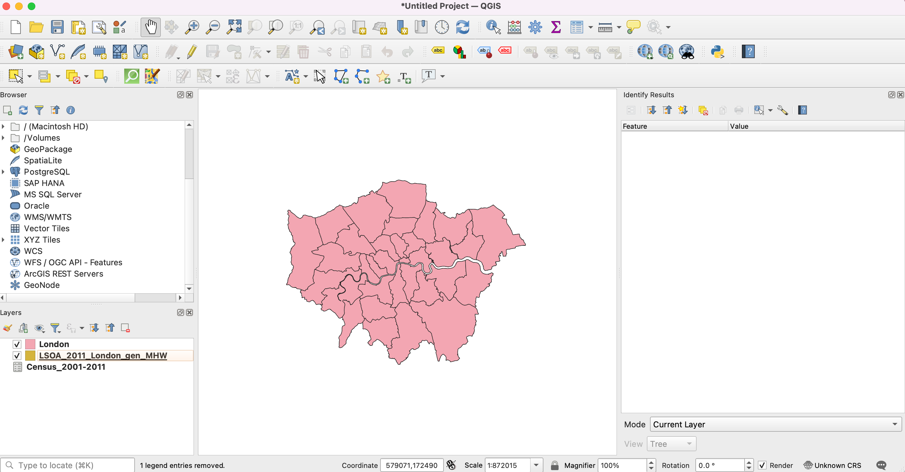
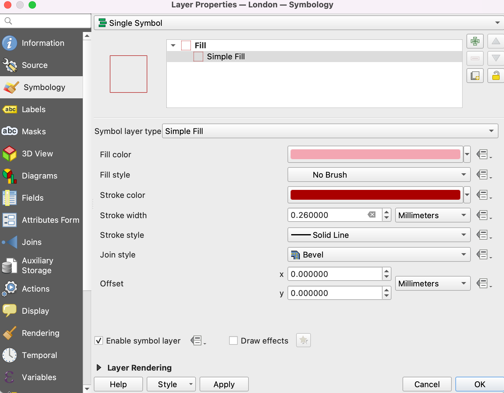
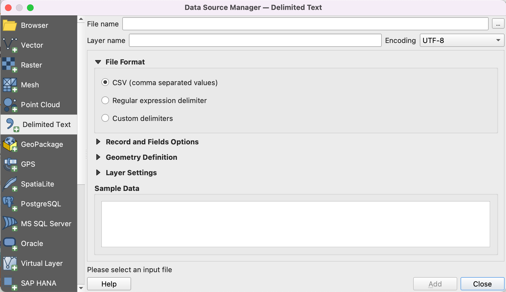
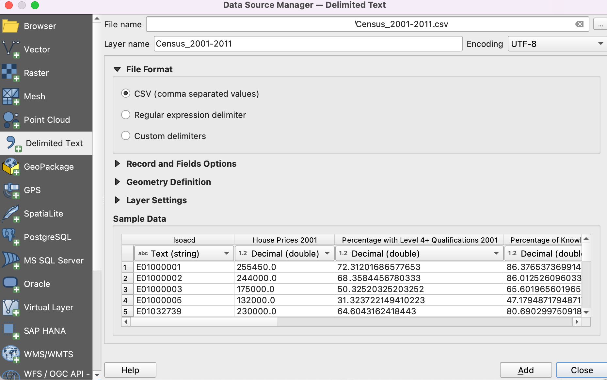
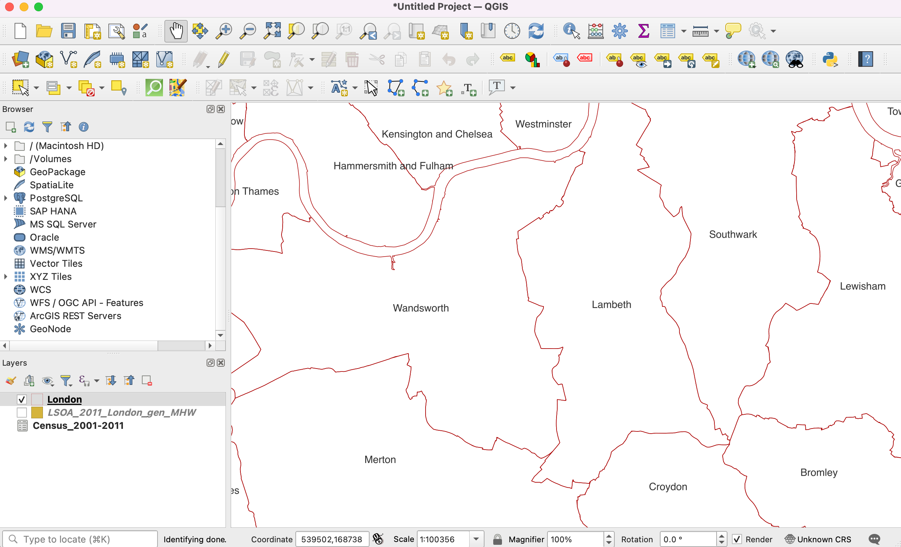
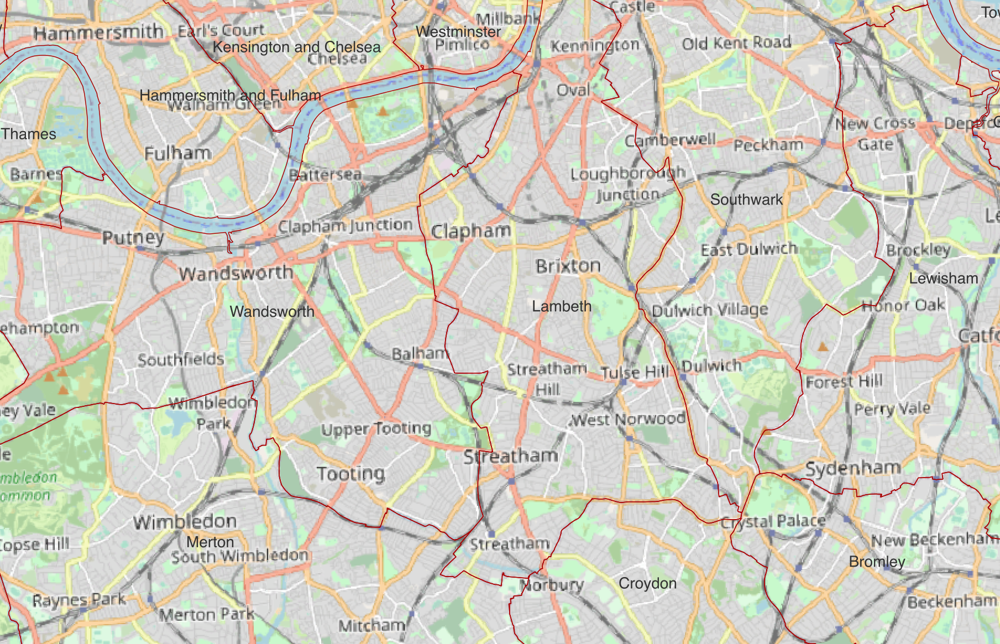

# Mapping Gentrification

## 1. Start QGIS

QGIS can be found under the Raspberry Pi menu (top-left) and then in *Education*. Start QGIS and you’ll get a welcome page like this:

Next, create a new, blank document by clicking on the… wait for it… blank document icon at the top-left of the screenshot below.

## 2. Add OSM & Explore

### 2.1. Add OSM Map Layer

Under the `Web` menu item at the top of your screen is a QuickMapServices option: 

1. Under `Web` in the main application window…
2. Pick `QuickMapServices`
3. Pick `OSM` (Open Street Map)
4. Pick `OSM Standard`

### 2.2. Find Brixton

Now zoom in on London using the magnifying glass (with the `+`) as below:

Panning (keeping the same zoom level but noving the map) is done using the Hand icon or by pressing the space bar and dragging the mouse. See if you can get Brixton in the centre of the map!

### 2.3. Check Out Street View

If you click on the Google Street View icon and then click+drag anywhere on the map you’ll see a Google Street View in your web browser showing the view from that point in the direction selected. 

### 2.4. Add Some OSM Data

Under the `Vector` menu you’ll see a `QuickOSM` option, and then a second `QuickOSM` menu item. select this. This will open a popup menu.

We are now going to build a *query*, meaning that we’ll be asking OpenStreetMap’s servers to find us locations fitting a particular description/having a particular tag. There are *many* tags and many *choices*, so a good way to find out what you want is to Google `OSM wiki <x>` where `<x>` is whatever you’re looking for (*e.g.* yoga studios, bars, etc.).

**Important:** London has a *lot* of data, so you *must* change the `In` drop-down to `Canvas Extent` and ensure you’re fairly zoomed-in on Brixton if you don’t want to waiting a *very* long time for data.

As a first go, your query could look like this:

Depending on how far you were zoomed in, after clicking `Run Query` you might get an answer nearly instantly or have to wait up to a couple of minutes! When the query completes you *should* see that *two* new layers have appeared in the lower left-hand corner of the QGIS app:

If you’re having trouble seeing the bars that you’ve added, try turning off the `OSM Standard` layer by clicking the tic-box next to its name!

### 2.5 More Information Please!

Select one of the two new `amenity_bar` layers by clicking on it in the Layers area, and then pick the ‘info’ button (it’s an arrow with an *i* in a blue circle). See what information you can find out about some of the bars! (As below)

#### Question:

1. Why do you think that *two* layers named `amenity_bar` were added to QGIS? *Hint:* try right-clicking on each one in turn and picking `Zoom to Layers` *then* turn each amenity layer on and off in turn while seeing if you can spot the difference!

## 3. Get the Data

OK, now let’s get the data that we need for this practical. I’ve (partially) prepared some data for you so that you don’t have to track everything down yourselves. There are two files you need:

1. [Borough Boundaries](https://github.com/jreades/talks/raw/gh-pages/in2science/data/London.gpkg)
2. [London LSOA boundaries](https://github.com/jreades/talks/raw/gh-pages/in2science/data/LSOA_2011_London.zip)
3. [LSOA-level Census Data](https://github.com/jreades/talks/raw/gh-pages/in2science/data/LSOA_2011_London.zip) on:
    - Median House Prices in 2001 & 2011
    - Median Household Income in 2001 & 2011
    - Percentage with Level 4+ NVQ Qualifications in 2001 & 2011
    - Percentage of ‘Knowledge Workers’ in 2001 & 2011 (Higher and Lower Managerial)

I would suggest moving all of these to your ‘Documents’ folder before double-clicking them to unzip them into files. 

## 4. Add the Borough Data

Going back to the `...` now add the `London.gpkg` file using the same process as in 2.2 and *then* click `Close`.  All the data is now added and you should now have something like *this*:

## 3. Show Some Data!

OK, we’ve got all the data into QGIS, how do we *do* anything with it?

### 3.1. Adjusting Boroughs

If your `London` layer (look in the lower-left of the above image) is not at the top of the Layers list then drag it to the top so that you can clearly see the borough boundaries (as above). Now:

1. Right-click (Ctrl+Click on a Mac) on the layer and pick `Properties` to open the `Layer Properties` popup
2. Pick `Symbology` from the area on the left.
3. Click on the area labelled `Simple Fill` (see below).
4. Change the `Fill color` to `No brush`
5. Change the `Stroke color` to a dark red.

Your Layer Properties should look something like this:

Click `OK` and have a close look at your map of London. You should now see the boroughs outlined in red with the LSOAs ‘behind’. 

### 3.2. Labelling Boroughs

Right-click on the London layer again to bring up `Layer Properties`, but this time pick `Labels` from the left-hand side:

1. Change `No labels` to `Single labels`.
2. The `Value` should already be set to `NAME` (which is what we want)
3. Change the font size to 14 (from 10.0000).
4. Click `OK` and you should now see labels for each borough.

## 4. Let’s Talk Data

### 1.1. *Look* at the Data

Try to see if you can open either of the downloaded files by double-clicking on them:

- Double-clicking on `LSOA_2011_London_gen_MHW.shp` *might* launch QGIS, or the computer might just say that it has no idea what to do.

- Double-clicking on `Census_2001_2011.csv` should show some kind of preview of several columns of data. I see the following in the first few rows:

| lsoacd    | House Prices 2001 | Percentage with Level 4+ Qualifications 2001 | Percentage of Knowledge Workers 2001 | Household Income 2001 | House Prices 2011 | Percentage with Level 4+ Qualifications 2011 | Percentage of Knowledge Workers 2011 | Household Income 2011 |
| --------- | ----------------- | -------------------------------------------- | ------------------------------------ | --------------------- | ----------------- | -------------------------------------------- | ------------------------------------ | --------------------- |
| E01000001 | 255450            | 72.3120169                                   | 86.3765374                           | 45630                 | 504999.5          | 77.5555556                                   | 88.6609071                           | 65520                 |
| E01000002 | 244000            | 68.3584457                                   | 86.0125261                           | 44970                 | 525000            | 79.195669                                    | 87.3626374                           | 66300                 |
| E01000003 | 175000            | 50.3252033                                   | 65.6019656                           | 36330                 | 350000            | 56.8438003                                   | 72.9057592                           | 54140                 |
| E01000005 | 132000            | 31.3237221                                   | 47.1794872                           | 31530                 | 300000            | 34.4701583                                   | 46.2184874                           | 46740                 |
| E01032739 | 230000            | 64.6043162                                   | 80.6902998                           | 44710                 | 447500            | 73.6465781                                   | 84.1269841                           | 62460                 |

The `lsoacd` is the *key* field here since it tells us what LSOA (a.k.a. small neighbourhood-type area) is being ‘talked about’ here.

#### Questions:

Thinking as a *scientist* about what we’ve discussed in earlier sessions, answer the following questions about the data and how they might connect to questions about gentrification:

1. What does each *row* represent?
2. What does each *column* represent?
3. What is the significance of 2001 and 2011 as dates for providing us with data? *The answer is in the name of the file…*
4. Why did I provide you with *median* instead of *mean* house prices and household incomes? *This is a maths question and your hint is*: $\sigma^{2} = \frac{\sum(x-\bar{x})^{2}}{N}$.
5. Why did I provide you with median *household* income instead of median *individual* income? *This is a measurment bias question…*
6. What is a Level 4 (or more) NVQ and why would I include this in the file? *Use Google to find this out…* 
7. Why would the share of Higher and Lower Managerial workers be included? *You might need to look at the [National Statistics Socio-Economic Classification](https://www.ons.gov.uk/methodology/classificationsandstandards/otherclassifications/thenationalstatisticssocioeconomicclassificationnssecrebasedonsoc2010).*

## 2. Load the Data

### 2.1. Add the Census Data

Click on `Layer`, and then pick `Data Source Manager` (**DSM**) in the menu at the top of your screen. This will bring up the dialogue box below, and then pick `Delimited Text` (as in the image below).

You now need to follow these steps carefully:

1. Click on the `...` to the right of ‘File name’ in the DSM manager.
2. Find where you saved the `Census_2001_2011.csv` file, select it, and pick `Open`.
3. You should now see the following (I’ve removed some details from the file path):

You can see that there are *data types* in the Sample Data area (double, string, etc.). We’ll accept the defaults that QGIS has chosen for us, but we *could*, for instace, tell QGIS to use integers instead of double-precision floats for House Prices since people don’t pay £157,340.26 for a house! 

There is *one* more thing to do *before* you click ‘Add’, and that’s to tell QGIS that there’s no geometry (i.e. nothing to actually map):

4. Click on the black triangle next to `Geometry Definition` and make sure that `No geometry (attribute only table)` is selected.

Now click `Add`, then `Close` once the DSM turns blank and… **nothing has changed! WTF???**

### 2.2. Add the LSOA Data

The reason we can’t yet see anything on the map is that we’ve just added data, we have told QGIS anything about how to *map* the data. In fact, this file contains no information at all that QGIS can use for mapping. We will fix that now.

To add the LSOA data:

1. From `Layer` select `Add Vector Layer`
2. You’ll see that you’re back in the DSM, but now the `Vector` option is selected.
3. Again, click on the `...` (to the right of `Vector Dataset(s)`).
4. And navigate to where you unzipped the LSOA zip file.
5. Select `LSOA_2011_London_gen_MHW.shp`
6. Click `Add`. **Don’t click `Close`!**

### 3.3. Hiding a Layer

Just for a moment, let’s hide the LSOA layer so that we can explore a bit. Hiding a layer is easy, just turn off the tic-mark next to the layer name in the `Layers` area of QGIS (lower-left are in the screen shot below):

### 3.4. Adding OSM Layers

I’ve installed *two* plugins for you:

1. QuickOSM
2. QuickMapServices

Right now we’re going to 

You should now see a background (low-res) map showing London like so:

The borough boundaries are now a little hard to see, right? Go back to 3.1. and see if you can make them a little easier to see by adjusting the Symbology…

