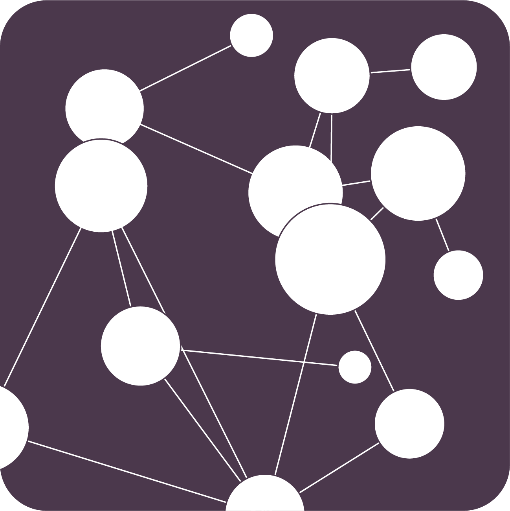

---
format:
  revealjs:
    theme: [serif, ../css/slides.scss]
    transition: slide
    transition-speed: fast
    multiplex: false
  html:
    standalone: true
    self-contained: true # Largely superseded by embed
    embed-resources: true
bibliography: Sheffield.bib
csl: harvard-cite-them-right.csl
nocite: |
  @reades:2021, @reades:2020, @arribas:2019, @maclachlan:2022, @wonkhe:2023
author: "Jon Reades"
footer: "Jon Reades (CASA @ UCL)"
highlight-style: github
code-copy: true
code-line-numbers: true
slide-level: 2
title-slide-attributes:
  data-background-image: ../img/CASA_Logo_no_text.png
  data-background-size: cover
  data-background-position: center
  data-background-opacity: "0.17"
logo: ../img/CASA_Logo_no_text.png
fig-cap-location: top
history: false
css: ../css/slides.css
---

# Building Foundations: Reproducible (Geographic) Data Science {background-image="./img/Print_Press_BL18077.jpg" background-opacity=".18"}

::: {.notes}
:::

## Context: Who is this guy?

Jon in five bullet points:

1. Undergraduate degree in Comparative Literature.
2. Dot.com startup web dev in New York/London for nearly 10 years.
3. PhD and post-doc in Urban Planning at UCL (CASA).
4. Lecturer/SL in Quantitative Geography at KCL for nearly 10 years.
5. Associate Prof in Spatial Data Science at UCL (CASA).

::: {.notes}

The reason I've put this up is to note a few things that are important to how I'm approaching this talk and the wider question of *why* reproducibility matters:

1. My background is not Computer Science. Most of what I've learned has been learned by doing, which is a nice way of saying 'learning by making mistakes'. Or to put it another way: yes, I *did* hose my company's web site once. Or twice.
2. So I've seen first-hand the value of tools that are rarely taught outside of Computer Science, and I'm thinking particularly here of things like Version Control and newer frameworks for literate programming and what feel to me like MVC approaches to writing such as Quarto and Pandoc. 
3. By the time I got to my PhD and was using bash scripts to back up my LaTeX files via SSH I had a sense that: a) there had to be a better way; and b) how was anyone *else* going to learn this stuff?
4. So when I got to King's as a newly-minted lecturer I had an opportunity to put some of my ideas to the test, and working with Dr. James Millington, who had a similar 'learning-the-hard-way' background we set out to design the first iteration of the module that this talk is about.

So what was our 'vision' for the module?

:::

## Our Vision... {background-image="./img/IMG_3898.png" background-opacity=".28"}

>  "Our vision for the modern teacher-scholar is having consistent reproducibility practices in how they conduct research, what they teach to students, and how they prepare teaching materials. We distinguish the three aspects as **reproducible research**, **teaching reproducibility**, and **reproducible teaching**..." [@dogucu:2022]

::: {.notes}

Well we didn't really have one, we'd just been tasked with building it! Which is why I really like this quote: it captures something the almost magical way that, in certain disciplinary contexts, teaching, research, and research on teaching can reinforce one another.

The authors went on to argue that "All teaching materials should be: **computationally reproducible**, **well-documented**, and **open**." And for many teachers that is a scary prospect, particularly those within more traditional, less computationally-intensive, domains within the social sciences, arts and humanities. 

So I want to be clear at the outset that I think this is currently a vision for a particular set of subdomains within fields: the Digital Humanities and the Computational Social Sciences, for example. The picture gets a lot more complex as we move into other areas though, of course, the fact that nearly *everything* is 'born digital' and the rise of LLMs — such as ChatGPT — implies that we'll see greater impacts down the line.

So within the fields that the benefits are most obvious — or least problematic — what might they be?

::: 

## Some Benefits of Reproducible Workflows

| For Students         | For Teacher-Scholars |
| -------------------- | -------------------- |
| Abstraction          | Abstraction          |
| Employability        | Employability        |
| Learning-by-Seeing   | Learning-by-Seeing   |
| Learning-by-Breaking | Learning-by-Breaking |
| Workload Management  | Workload Management  |

::: {.notes}

I'm going to confess up-front that this is a slightly optimistic assessment of what reproducibility can bring to our teaching on reproducibility, but the point I'd like to make here is that many of things that we *ourselves* benefit from when we work reproducibly can also attach to our students.

Perhaps the extent of the alignment of interest is more obvious we move away from the mixed terminology of economic geography and computer science:

Our staff *typically* want to:

- Spend less time in Moodle/Blackboard.
- Spend less time distributing/updating materials.
- Spend more time on the interesting stuff.
- Get to some useful results as quickly as possible.

Our students *typically* want to: 

- Have little prior experience of coding or data science.
- Have first degrees in Social Sciences/far-STEM.
- Get employability credential.
- Get to the answer as quickly as possible.

I'd argue that these benefits appear at all stages of the student and teacher journey, but that they become *more* obvious as students make the transition from undergraduate to post-graduate to post-doc to instructor. And this module sits at the point in that journey where students transition from undergraduate in a non-CS pathway to someone apparently planning to use code/practice coding everyday.

:::

## Context: Foundations in Spatial Data Science {background-image="./img/Blueprint_BL19358.jpg" background-opacity=.18}

> This module provides students with an introduction to programming through a mix of discussion and coursework built around an applied spatial data science question using real-world data. The module is intended to... show how geographic and quantitative concepts are applied in a computational context as part of a piece of spatial data science analysis.

::: {.notes}

So this is an integrative module that tries to draw together content taught on other modules and show students how the pieces fit together:

- I was particularly keen that the module use real-world data — I have a horror, rooted in experience, of modules taught using cleaned data where each week sees a different data set introduced, some tests applied, and a fairly trivial set of outcomes produced.
- In order to do *that* it was my feeling that the module itself *also* needed to be rooted in how things are done in the real-world — fortunately, beyond my own experience I could draw on friends in the software sector and colleagues with a wide range of backgrounds and experiences.
- I was also keen that the module support critical reflection on all of these aspects by encouraging — or forcing — students to engage with all of these issues as part of the learning journey.

But despite that critical element it's also obvious that this is going to be a module about tools.

:::

## Technical Evolution

|                 | v1 (2013–2018) | v2 (2019–2021) | v3 (2022–2023) |
| --------------- | ------------------- | ------------------- | ------------------- |
| **Platform**    | USB Key w/ Ubuntu   | Conda YAML          | Docker              |
| **Language**    | Python 3.4          | Python 3.6          | Python 3.10         |
| **Versioning**  | SVN/Dropbox         | GitHub              | GitHub              |
| **Content**     | PowerPoint          | PowerPoint          | Quarto/GitHub.io    |
| **Environment** | Spyder              | Jupyter             | Quarto/JupyterLab   |
| **Assessment**  | Word                | Jupyter Notebook    | Quarto              |

::: {.notes}

And what are the tools? Well hopefully most of this is *vaguely* intelligible to you, but if it doesn't DON'T PANIC because I've put this here to focus on a few key dynamics:

1. The acceleration in the rate at which I'm changing how the module is maintained and distributed to students — I'm making more changes, more quickly, and I'd suggest that this is actually a good thing.
2. That's because I've been progressively moving more and more of the substance of the module into open source frameworks, and making more and more of the module fully open and reproducible by anyone at all.
3. The v3 technologies are the ones that I use to create the module and they're also the technologies that I require students to use in order to complete the module.

But the **really** important thing here is that my v3 *teaching* environment is exactly the same as my v3 *research* environment. So to answer the question: how do I know that what I'm teaching them about reproducbility is relevant? The simplest answer is: because they're the same tools and techniques that I'm using to produce reproducible research!

:::

## The v3 'Stack'

::: {.incremental}

- Why Docker?
- Why Git/GitHub?
- Why JupyterLab?
- Why Quarto?

:::

::: {.notes}

**Docker**: integral infrastructure for contemporary data science and analytics, so building basic familiarity with it now — before students develop preconceptions about local vs. remote — is valuable. It also radically simplifies distribution of the programming environment: students can install everything with one command and we *know* they'll all have the same versions installed on their machines. Debugging becomes radically simpler and recovery is much, much faster when they forget to turn off "Automatically apply software updates".

**Git/GitHub**: for most of our students GitHub *is* Git, and while we try to explain the basic principles behind a distributed version control system, we also don't want to attach too much importance to it during the introductory period. We start off by highlighting how version control allows them to backup their code easily and effectively so that they don't need to worry about recovering if they break something. Later in the term, we introduce how it can do a lot more than this by requiring — as I'll get to in a moment — collaboration between students.

**JupyterLab**: if you teach Python then it's *almost* a certainty that you now teach using Notebooks and JupyterLab. While starting with notebooks can create *some* issues around debugging (deleted cells who effects are still felt in system state, if you will), the ability to do literate programming while running code iteratively and interactively outweighs these limitations.

**Quarto**: this was last year's transformative experience when Andy, who you'll hear from later, pointed me to Quarto as I struggled to combine Bookdown/R with a module that was fundamentally about doing things in Python. By allowing me to combine module presentation, content, and learning materials, in one place Quarto was a game-changer. I now use Moodle mainly to collect assessments, send out formal messages about the module, and signpost other content. The rest — all of it — is basically rendered Markdown. 

And the great thing here is that all of it is what I use for my own research practices and encourage my doctoral students and post-docs to do as well. So as I learn things about, say, Reveal.js presentations (such as in preparing this talk) I can put that knowledge back over to my taught module content. And vice versa.

OK, so that's the underlying rationale, how does this play out in practice?

::: 

## Module Structure {auto-animate=true}

1. Foundations
2. Data
3. Analysis

::: {.notes}

The module is organised into three main sections which are intended to very broadly mimic the data science workflow — from project setup to EDA — while allowing for the fact that few of our students will yet have the faintest clue what a computational workflow should look like.

:::

## Module Structure {auto-animate=true}

1. Foundations
    - Setting Up
    - Foundations Part 1
    - Foundations Part 2
    - Objects & Classes
2. Data
3. Analysis

::: {.notes}

So we allocate time across the first couple of weeks to getting the students up and running with the toolset while they also cover off the basics of coding in Python. This is undoubtedly ambitious, though to *some* extent we're helped by the fact that the students *want* — to greater or lesser extent — to learn this stuff. 

The other thing we've done is to expand the content beyond the confines of the class: there's an optional, but strongly encouraged, self-paced summer module called Code Camp which introduces students to Python in a zero-installation process that combines web-based instruction with coding in Google Collab.

We're also adding an 'install-fest' during Induction Week that we're deliberately setting up as a social with pizza and soft drinks. By installing the frameworks up front we are able to stress the common patterns of software infrastructure and get away fro the idea that something that is used in one module can be ignored in all the others.

Nonetheless, during those first few weeks the practicals involve simple things like setting up a GitHub account and creating — and synchronising — their first Markdown document via GitHub. So we're trying to bed in the idea that Git content doesn't have a local master by encouraging them to mix the use of the web editor with local edits. 

They will also be pulling images and doing other preparatory work such as rendering their first Quarto document to PDF. We've gone with a monolithic Docker image, which is slightly against the spirit of Docker but serves us well on a practical level.

:::

## Module Structure {auto-animate=true}

1. Foundations
2. Data
    - Numeric Data
    - Spatial Data
    - Textual Data
3. Analysis

::: {.notes}

I'm not going to spend much time on the remainder of the module, but the next three weeks present the same data from a variety of different angles to show how you can build an analysis iteratively and interactively rather than linearly and simplistically. Helpfully, this actually reinforces the importance of documentation.

In addition, I just want to note that we also have a 'bug hunt' in which students are encouraged to file GitHub issues covering bugs and suggested improvements: the student making the most valuable overall contribution can choose a charity to which I will make a donation at the end of term.

:::

## Module Structure {auto-animate=true}

1. Foundations
2. Data
3. Analysis
    - Dimensions in Data
    - Grouping Data
    - Visualising Data

::: {.notes}

The final part focusses on the outputs from preparation, cleaning, and EDA so, again, it need not particularly detain us here; however, it *does* connect back to how we assess them and how we've tried to use that reinforce the reproducibility and sustainability angles.

:::

## Week-by-Week

Each week entails:

- Assigned readings from a mix of academic and non-academic sources (e.g. Medium/Towards Data Science)
- Pre-recorded short videos on specific concepts or topics.
- An optional Moodle quiz to test understanding.
- A live-coding session which incorporates discussion of week's assigned readings (students selected using Python random-number generator 😅).
- A small group practical using a Jupyter notebook.

::: {.notes}

In common with @Ostblom:2022 "we primarily employ guided instructions through... 1. Live demonstration; 2. Pre-lecture activities; 3. Worksheets." Students can rely on this design pattern and get into what I hope are good longer-term habits. 

And that eventually brings us to... 

:::

## Assessment {background-image="./img/IMG_3344.png" background-opacity=.21}

> "... three pedagogical strategies that are particularly effective for teaching reproducibility successfully: 1. placing extra emphasis on motivation; 2. guided instruction; 3. lots of practice." [@Ostblom:2022]

::: {.notes}

While I agree with @Ostblom:2022 in the round, the sad truth is that there is a fourth motivation: will it be on the test? While we can, as @dogucu:2022 puts it: "... set an example to students and provide them with further exposure to the tools they use for their own learning," embedding it in the assessment itself is also, I think, critical.

:::

## Assessments {auto-animate=true}

1. Time-limited coding quiz (30%)
2. Group critical data science project proposal (50%)
3. Peer evaluation of contributions (20%)

::: {.notes}

The module has three assessments.

:::

## Assessments {auto-animate=true}

1. Time-limited coding quiz (30%)
    - Hidden randomisation of data 
    - More obvious randomisation of questions 
2. Group critical data science project proposal (50%)
3. Peer evaluation of contributions (20%)

::: {.notes}

The quiz is open book, and we primarily use it as a means of ensuring that students acquire basic fmiliarity with the terminology and concepts underpinning Python up to the point of being able to make use of Pandas. We tell the students that, like learning a language, some basic knowledge is essential to performing well but that we are not expecting fluency and the timing element is designed to suppor that -- if the students have been, as we've advised, practicing regularly, rather than cramming, then it will be fairly easy to do reasonably well.

However, an open book quiz is fairly easy to cheat, so we've tried to do two things here: 

1. The questions are randomised, so blindly copying code won't work since you might be asked to calculate a different metric.
2. The data itself is randomised, making it difficult to copy answers even if you're sat next to someone with all the answers.

:::

## Assessments {auto-animate=true}

1. Time-limited coding quiz (30%)
2. Group critical data science project proposal (50%)
    - Quarto document (incl. references)
    - Reproducibility (12%)
    - Output quality (6%)
    - Code 'quality' (6%)
    - Content (36%)
3. Peer evaluation of contributions (20%)

::: {.notes}

This is the heart of our testing student comperhension of reproducibility: we didn't want this to be the *only* mark that students received, but we did want it to be a major consideration. 

In previous years we asked for a Jupyter Notebook instead, but we've had issues parsing it for plagiarism and major problems with the use of GitHub for collaboration. So this year it's all Quarto, which means it's all Markdown or simple Python. You'll notice that we do priortise the content of the report, but coding aspects -- and reproducibility in particular -- carry quite a bit of weight as well. We are clear about how this works and require that students ensure their report compiles using Docker (one of the reasons we've got a monolithic image). We look for things like tuning the figure outputs and execution to improve clarity and robustness of the code.

This year we're also shifting to incorporating incremental submission: so the students are working on this structure proposal -- which will include figures and metrics drawn from the actual data -- from week 3, with new questions being added each week for the students to answer. They may be called upon to present their answer to the preceding week's questions and I will provide general feedback to the entire class on how a group's response does/does not meet the specification. There is a back-loading to the question weights with the final few worth the most and these are the ones on which students will not receive feedback.

:::

## Assessments {auto-animate=true}

1. Time-limited coding quiz (30%)
2. Group critical data science project proposal (50%)
3. Peer evaluation of contributions (20%)
    - GitHub history used in event of group meltdown
    - Contributions assessed across project dimensions

::: {.notes}

So what that means is that we should have a decent history in GitHub to draw on in the event of disputes (and students will be told that this is how we will use it!), but we also ask students to rate each others' contributions to the project. There is no penalty for being dead weight, but there is a reward for contributing -- I'm still working out some of the details in mechanisms here, but the idea is to give students a range of metrics so that they appreciate that robust data science isn't just about who's the 'best' coder.

:::

# Towards the Promised Land? {background-image="./img/Promised_Land_BL3956.jpg" background-opacity=.71}

- Automate All the Things?
- Multiple Docker images
- REF (2028) it?

::: {.notes}

What's next for *Foundations*? Currently I'm working on:

1. Extending replication and automation deeper into the module's content — I'm hoping to automate the creation and updating of the videos used in the flipped format using decktape and ffmpeg to convert the Quarto presentations to PNGs then merge them with audio and video tracks and watermark dynamically.
2. More obviously, right now I'm pushing the whole web site to GitHub and, hence, to GitHub.io but it should be *fairly* straightforward to use a Continuous Integration approach that pushes the build on to a server and also makes it easier for others to fork, maintain, and contribute.
3. As I said earlier, right now we've got a monolithic Docker image but to more effecitvely mirror real-world dev practices we should really be looking at a more modular system with different images that are designed to achieve different stages of the analysis.
4. And more broadly, the broad outline of REF2028 has just been announced and it's clear that they want to promote wider thinking on research environment — now called people and culture — and the contribution of 'outputs' to the advancement of a discipline... Perhaps I'm overly optimistic, but it seems to me that there should be opportunities for those of us who embed @dogucu:2022's framework across our teaching practices would be in a good place to demonstrate our commitment across these areas (People & Culture; Contribution to Knowledge and Understanding; and Engagement and Impact).

:::

## {background-image="./img/Promised_Land_BL3956.jpg" background-opacity=.21}

{.absolute height="125" top=0 left=800 fig-alt="Logos of CASA and British Library"}

### Jon / <a href="https://twitter.com/jreades"> \@jreades</a> / <a href="https://github.com/jreades"> jreades</a>

### Acknowledgements

The work presented here builds on the contributions of many (not least the FOSS community!), but I'm particularly indebted to *Dani Arribas-Bel* and *Andy Maclachlan* for pointing me towards critical pieces of the puzzle.

Module content [jreades.github.io/fsds/](https://jreades.github.io/fsds/)

### References

